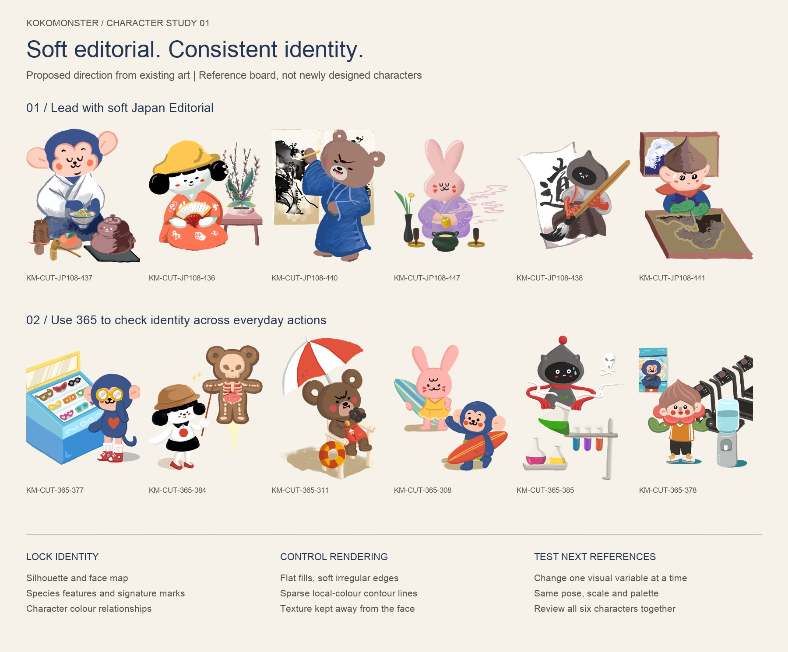

# Kokomonster — character style exploration v0.1

**Recommendation: soft editorial characters with consistent construction.** Keep the six established identities, use the quiet painted treatment in Japan Editorial 436–447 as the visual lead, and use selected 365 everyday poses to check repeatability. New references should influence rendering, gesture and atmosphere within these boundaries.

This is a proposed system for testing, dated 11 September 2026. It is not an approved replacement model sheet. All pictured characters are existing authored artwork; no new character artwork has been generated. The exploration is separate from the Shopify theme.

## 1. Evidence and scope

I checked all 178 files referenced by the local manifests: 108 JP108 and 70 selected 365 exports. Every file exists, is 1500 × 2100 RGBA, and has alpha extrema 0–255. Seven contact sheets cover all files; selected full-resolution artwork was also inspected for surface and line treatment. This is a visual survey of the existing exports, not a new audit of the layered Drive masters or the six rotation assets.

The source register is [source-audit.json](source-audit.json). It records asset code, path, canvas, alpha, bounding box and available master name. Source authority comes from the theme’s `jp108-extraction-manifest.json`, `365-extraction-manifest.json`, `layered-source-inventory.json` and `CHARACTER-VISUAL-GUIDE.md`. Character names follow that existing guide; the thematic roles in it are editorial assignments, not anatomical evidence.

| Observed family | Evidence | What it contributes | Boundary for the new system |
| --- | --- | --- | --- |
| Soft painted editorial | JP108 436–447 | Tactile edges, economical face marks, rounded anatomy, detailed cultural activity props | Primary rendering reference; reduce costume complexity for neutral poses |
| Flat editorial and festivals | JP108 460–471, 508–531 | Clear colour blocks, emblem-like staging, cooperative scenes | Useful scene structure; separate scenery from the character model |
| Dense inked costume art | JP108 472–495 | Strong outlines, hatching, elaborate costumes and expressive poses | Retain as an authored special treatment; do not average its line density into the everyday system |
| Folklore transformations | JP108 496–507 | Dramatic narrative silhouettes and ornamental cloud fields | Story-specific transformations do not define ordinary character anatomy |
| Selected 365 companions | 365 245–256, 308, 370–404 | Repeatable faces, large heads, short limbs, intelligible everyday actions | Check identity and utility; some settings are much busier than a reusable pose |
| Atmospheric or prop-led art | 365 257–259, 298–299, 305–307, 309–310, 312 | Clouds, weather, animals and object vocabulary | Scene references, not evidence for the six-character construction system |

### Asset quality finding

RGBA transparency is necessary but insufficient for a reusable pose. Music exports such as 245–256 visibly contain neighbouring artwork fragments. Several JP108 exports retain cloud fields, background panels or edge fragments; 496–507 are conspicuous examples. Many 365 shop and campus exports retain substantial authored settings.

Do not change their stable asset IDs or overwrite their pixels during this exploration. Before reusing any as a character-only asset, inspect its master layers and classify it as **clean pose**, **character with activity setting**, **prop-only**, or **needs extraction review**. The source register reports technical checks, not an assertion that all 178 are visually clean. The contact sheets deliberately retain the entire visible alpha bounding box so these issues remain visible.

## 2. Anatomy and identity locks

Across the quieter examples, the family resemblance comes from large rounded heads, compact bodies, short soft limbs, minimal noses and mouths, and warm cheek accents. Hands are simplified but action-dependent; imposing one universal finger count would contradict the source. Heads remain readable through costumes. Different characters need distinct silhouettes, not the same body with different ears.

| Character | Preserve | Source anchors | Still needs a neutral master check |
| --- | --- | --- | --- |
| Koko | Blue/navy head and body; peach face mask and round projecting ears; dark nose and curved muzzle marks; warm cheeks; chest heart when exposed; curved tail | JP108 430, 437, 509; 365 308, 377 | Unobscured front face and neutral body proportions; glasses in 377 hide the eyes |
| Gohanko / Rice | White face/body; black fringe and paired side buns; small dark eyes and smile; red cheeks and torso circle when exposed | JP108 436, 446; 365 247, 384 | Default hat, bag and outfit from identity masters; scene costumes often replace them |
| Bear | Broad round head, round ears, brown body, lighter muzzle, characteristic brow/nose/mouth arrangement | JP108 431, 440; 365 311, 382 | Neutral brows versus determined expression; brown varies between families |
| Rabbit | Long paired ears, pink head/body, compact face, characteristic cheek marks and muzzle | JP108 439, 447; 365 250, 308 | Ear length relative to head; open-eye expression reference |
| Ghost | Pointed grey hood-like head, dark oval face with light eye/mouth marks, compact tapered body; red accents including scarf/arms and top sphere where present | JP108 426, 438, 517; 365 385, 401 | Top sphere and hood details vary; do not silently discard them or treat a missing/covered feature as a redesign |
| Tree | Tall pointed, grooved brown crown; pale face, projecting ears, warm cheeks; green plant-like hands in several cultural examples | JP108 429, 441, 442; 365 249, 378, 397 | Crown construction and default hands/body under everyday clothing |

Costume, hat and action props are separate layers of specification. A costume may cover an identity mark; it does not authorize relocating or redesigning it. The source guide’s 360 Lottie references are the next authority for unseen views. Do not invent profile or back details from a front scene.

## 3. Controlled rendering and proportion system

The following numbers are **proposed test tolerances**, not measurements of an official model sheet.

| Control | Starting rule | How to check |
| --- | --- | --- |
| Proportions | Choose one neutral source per character. Define H as skull height, excluding ears, crown, hats and props. Record body/H, skull width/H, ear/H and eye separation/skull width independently for each character | Compare the same view and pose; start with ±5% deviation from the chosen anchor. Do not measure a whole scene bounding box as body height |
| Face map | Keep eye, nose, mouth and cheek placement tied to the anchor; use source expressions for the first tests | Overlay aligned heads; expression changes may move mouth and brows, not reshape the identity mask |
| Silhouette | Rounded volumes, short limbs, intentional asymmetric gesture; preserve character-specific ears, crown, tail or hood | Test a solid silhouette at 96 px character height, then inspect details at 100% |
| Line work | Selective darker local-colour contours, soft irregular edges; concentrated dark marks around face and contact points | Begin with a contour around 0.8–1.2% of H and finer internal lines. Avoid a uniform black perimeter around every shape |
| Fill and shadow | Dominant flat fill plus at most one restrained shadow value per material in the initial test | No volumetric lighting model, glossy highlights or shadows crossing the facial marks |
| Texture | Sparse brush/grain variation on clothing, props and broad shapes; keep face fields clear | At 96 px the texture should recede before the face does; judge beside the flat control |
| Expressions | Neutral, delighted, curious, concerned and determined, using actual source expressions where available | Maintain each character’s facial vocabulary; missing expressions stay unresolved until checked |
| Gesture | One legible action, clear hand/prop contact and readable eye direction | Show without caption; confirm what the character is doing |

Avoid treating every stylistic difference in the archive as a rule. The proposed novelty is a repeatable balance of soft editorial surface and clear everyday construction, with a consistent face map for each character.

## 4. Palette proposal

Retain character colour relationships first. Backgrounds, clothes and cultural props can change without recolouring the character to match the scene. Use a warm ivory presentation ground as an exploration choice, not an established brand token.

These starting swatches are exact RGB values found among frequent opaque pixels in the named exports, with visual interpretation of their role. They are **candidate anchors**, not approved brand colours; counts include the whole composition and cannot certify a character region by themselves. See [palette-evidence.json](palette-evidence.json). Final model-sheet colours need region sampling and colour-profile verification against the masters.

| Candidate | RGB hex | Evidence |
| --- | --- | --- |
| Koko blue / peach face | `#3C558A` / `#FBC2AB` | 365 377 |
| Gohanko white / near-black | `#FFFFFF` / `#000102` | 365 384 |
| Bear brown | `#805E44` | 365 311 |
| Rabbit soft pink | `#F0C0BC` | JP108 447 |
| Ghost grey / face / red | `#676464` / `#252323` / `#D73536` | 365 385 |
| Tree crown / face | `#AD7A6D` / `#F6D5C3` | 365 378 |

Do not collapse all reds to Ghost’s red or all browns to Bear’s brown. The chest heart, cheek accents, scarf and props require their own verified mapping. For tests, keep assigned colours fixed while changing line or texture.

## 5. Scene language

Start with a character, a clear action and the minimum props that explain it: handling a tea bowl, playing an instrument, studying a specimen. JP108 contributes culturally specific objects and cooperative festival staging. The selected 365 art contributes approachable everyday contexts and simplified three-quarter settings.

Use three deliverable classes: **pose** (one character), **activity vignette** (character plus essential props), and **complete scene** (authored environment). Label the class explicitly. A laboratory bench or shop interior may be legitimate in a vignette or scene, but should not be mistaken for a clean neutral pose. For initial new-scene tests, use one main character, one focal activity and no baked text. Expand to ensemble scenes only after the six characters look coherent together.

## 6. Test plan for the additional references

Keep the source-based direction board as the control. Assign each incoming reference `REF-001`, `REF-002`, etc., and record exactly what to borrow: line, shape simplification, texture, colour atmosphere, gesture or staging. Record what must stay fixed. A reference is not blanket permission to replace facial identity.

1. Compare each reference against the identity locks and record conflicts before making artwork.
2. Choose neutral approved identity references for all six; log any missing view or expression. Existing action scenes supplement those references.
3. Test Koko in the same presenting pose, crop, palette and size across three treatments: **A** flat control; **B** soft editorial texture, the recommended direction; **C** slightly more visible local-colour contour with the same texture as B. B versus C isolates line treatment; A versus B isolates texture.
4. Apply the best treatment to the same neutral pose set for all six. Then test one everyday action, one Japanese cultural action and a three-character interaction. Use an approved source asset whenever it already supplies the needed pose.
5. Review each at 96, 256 and 1024 px character height, on light and dark grounds. Check silhouette, face spacing, colours, prop contact, texture and transparent edges.
6. Score identity, family consistency, action clarity, small-size clarity and intended reference influence from 1–5. Proposed pass: identity and family consistency ≥4, no other score below 3, and no hard failure. A missing/changed signature feature, incorrect anatomy, clipped silhouette or residual artwork fragment is a hard failure regardless of average score.

[reference-tests.json](reference-tests.json) is ready for recording these trials. Scores and reference fields are intentionally blank until there is artwork to judge. This stage ends with an approved treatment and character model-sheet decisions, not automatic production replacement.

### Brief template for the next visual trial

> Create an exploratory [pose / vignette / scene] using the supplied approved [character and asset ID] as the identity reference. Action: [one action]. Match the chosen view and character scale. Preserve [character-specific silhouette, face map, colour assignments and signature marks]. Borrow only [specific rendering property] from [REF ID]. Use treatment [A/B/C] with the controls in this guide. Keep the palette and anatomy fixed. Include only [essential props]. Output is an exploration candidate for side-by-side review.

Use image generation for genuinely new raster trials when needed; the current task stops at an evidence-based system ready for the user’s references. Every generated trial must retain its prompt, reference IDs, version and review status. Store candidates separately from approved assets. Continue the existing guide’s owner-review step before any production or advertising use; it does not prevent exploratory work here.

## 7. Files and next decision

- [Direction board](direction-board.jpg): twelve authored examples spanning all six characters and both libraries.
- [JP108 survey 1](audit-jp108-1.jpg), [2](audit-jp108-2.jpg), [3](audit-jp108-3.jpg), [4](audit-jp108-4.jpg).
- [365 survey 1](audit-365-1.jpg), [2](audit-365-2.jpg), [3](audit-365-3.jpg).
- [Technical source register](source-audit.json), [palette evidence](palette-evidence.json), and [trial register](reference-tests.json).

The additional visual references will determine how far to move the surface and line treatment. Neutral character masters will determine the final numerical proportions. The current landing page, theme assets and existing design-library manifests were not edited.
