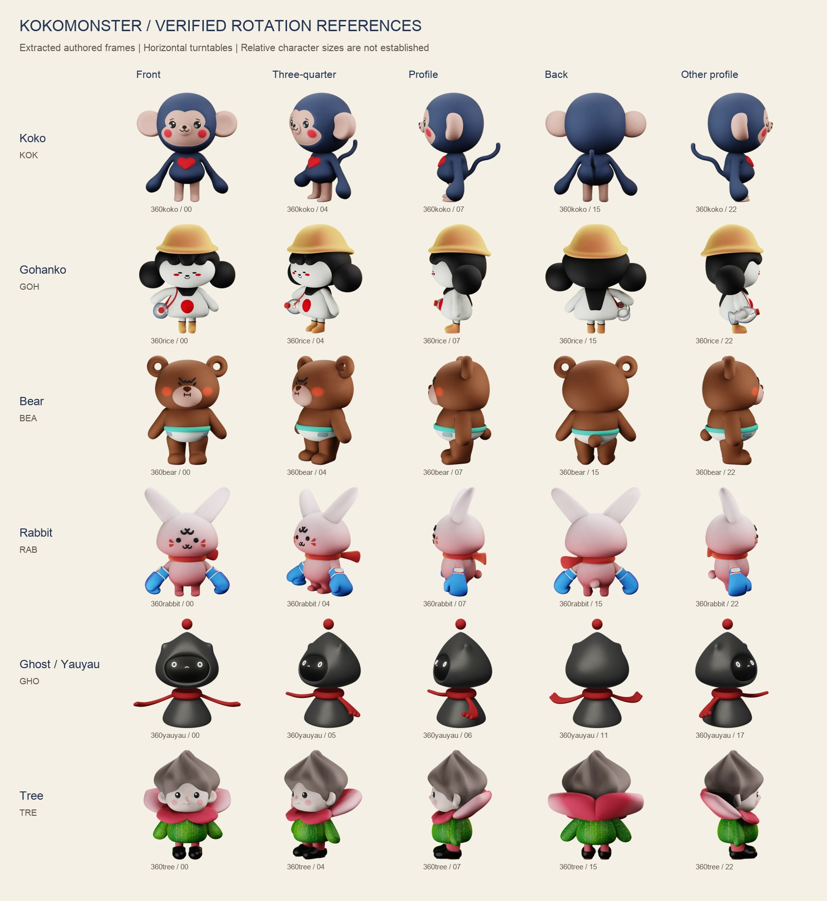

# Kokomonster character and world system — v0.2

**Identity correction gate:** User flagged inconsistent Koko nose, missing Gohanko/Rabbit/Tree noses and a third Yauyau scarf attachment in trial art. These are errors, not allowable style variation. Every pose must preserve its character-specific nose construction, and Yauyau must have exactly two scarf-arm attachments. A/D/E remain the shortlist; [F — 365 Companion](game-style-trials/F-365-companion.png) is an added comparison against authored 365 styling. See [identity rules and E proportion recommendation](game-style-trials/IDENTITY-REVIEW.md). Earlier candidate PNGs have not yet been corrected.

**Latest user preference:** Retain A — Flat Adventure. B — Bold Sticker and C — Soft Story Game are not preferred and are removed from the active shortlist. Compare A with D — Colour Doodle (high-contrast flat fills and loose drawing strokes) and E — Outlined Isometric (flat outlined editorial characters with an elevated view). See [round-two review](game-style-trials/ROUND-2.md). No final finish is selected yet.

**Current exploration update:** The user has requested comparison of game-inspired illustration finishes before choosing the main 2D style. See [game-style trial criteria and review](game-style-trials/REVIEW.md) and the three generated cast boards: [A — Flat Adventure](game-style-trials/A-flat-adventure.png), [B — Bold Sticker](game-style-trials/B-bold-sticker.png), [C — Soft Story Game](game-style-trials/C-soft-story-game.png). The earlier soft-editorial recommendation below remains a candidate rather than a selected direction. Verified rotation references remain the identity authority.

**Recommendation: one shared character construction system, expressed through a soft editorial finish for stories and landing-page scenarios, plus the existing dimensional finish for character selection and profile moments.** Build scenes from reusable characters, props, environments and layout recipes. Identity stays stable; the composition adapts to the platform.

Updated 12 September 2026. Rotation inspection is complete. The design rules below are recommendations for testing, not a claim of new brand approval. The current landing page and theme files were not changed.

## What the rotation files establish

The six original files were retrieved from [Monster selection page → character 360 - lottie](https://drive.google.com/drive/u/1/folders/1p2s5mejBbgOjJe6nkAVDBClTUeYdEI3W). All 173 embedded frames were decoded and visually surveyed in source order. Representative native frames were inspected in detail.

| Character | Original | Frames / fps | Declared canvas | Decoded images |
| --- | --- | --- | --- | --- |
| Koko | [360koko.json](../../character/rotation-sources/360koko.json) | 30 / 30 | 500 × 500 | 812 × 812 WebP |
| Gohanko / Rice | [360rice.json](../../character/rotation-sources/360rice.json) | 30 / 30 | 500 × 500 | 812 × 812 WebP |
| Bear | [360bear.json](../../character/rotation-sources/360bear.json) | 30 / 30 | 500 × 500 | 812 × 812 WebP |
| Rabbit | [360rabbit.json](../../character/rotation-sources/360rabbit.json) | 30 / 30 | 500 × 500 | 812 × 812 WebP |
| Ghost / Yauyau | [360yauyau.json](../../character/rotation-sources/360yauyau.json) | 23 / 23 | 500 × 500 | 812 × 812 WebP |
| Tree | [360tree.json](../../character/rotation-sources/360tree.json) | 30 / 30 | 500 × 500 | 812 × 812 WebP |

Each timeline lasts one second. These are rendered image sequences in Lottie containers: one image layer per timeline frame, with embedded WebP assets. They do not contain editable meshes, materials or a character rig. Lottie’s documented [image-layer structure](https://lottiefiles.github.io/lottie-docs/layers/) matches the inspected `ty: 2` and `refId` entries.

They show a complete horizontal turn, including front, both profiles and back, at a fixed viewing elevation. They do not establish top/underside views, arbitrary camera elevation, joint deformation or a library of expressions. Frame progression includes very similar opening/closing poses; a frame number must not be treated as a uniformly spaced angle. The board labels the closest observed views, not calibrated orthographic projections.

**Correction:** the earlier guide listed `360ghost.json`. The inspected folder contains `360yauyau.json`, visually corresponding to the character called Ghost in the editorial library. Preserve the source filename and register Ghost as the working alias.

The 500 px declared asset dimensions differ from the 812 px decoded images. Our boards show the extracted images, not screenshots of a Lottie player. Test actual player sizing, clipping, alpha and WebP support in each target runtime before shipping the original animations. The dimensional rendering contains baked lighting, so sampling it does not recover material base colours.

## Source authority by question

| Question | Authority |
| --- | --- |
| What is behind an ear, where does a tail attach, how does the silhouette turn? | Inspected rotation frames |
| What do cultural costumes, Japanese objects and activities look like? | Approved JP108 layers and complete scenes |
| How does an everyday action or location read? | Selected compatible 365 artwork |
| How should the future landing-page art be rendered and composed? | Proposed editorial treatment and scene recipes below |
| What is the official pigment/material colour or unseen anatomy? | Original character/model masters when available; not recoverable with certainty from these rendered rotations |

Use a matching view from the rotation as the construction reference and a matching editorial example as the rendering reference. Do not average their visual differences into a new face. The [v0.1 source audit](STYLE-SYSTEM-v0.1.md) remains useful evidence for the 178 card exports; its proposed flat shading rules apply to the editorial finish only.

## Character construction and variant decisions

| Character | Verified observations from rotation | Proposed rule for future artwork |
| --- | --- | --- |
| Koko | Large rounded navy head, projecting peach ears and face mask; red circular cheeks and chest heart; small torso, long drooping rounded arms, short peach legs; narrow tail attaches at lower back and curves upward | Preserve face mask, heart, ear volumes and tail attachment in both finishes. Long arms are part of Koko’s construction; do not replace them with the same short limbs used for every character |
| Gohanko | Yellow/tan domed hat and brim; black rounded fringe, paired side buns, back hair and black neck/back strip; white flared body with red circle; yellow footwear; red straps and circular translucent-looking accessory at one side | Preserve hat/bun silhouette and front/back hair arrangement in the default outfit. Record the accessory’s side from each view. Simplify its transparency in editorial art, without inventing its function or flipping it across the body |
| Bear | Rounded ears with pale centres, projecting pale muzzle, small black nose and angular brow; stocky torso and legs; small round rear tail; white lower garment with turquoise waistband | Preserve muzzle volume, stocky build and tail. Treat this outfit as the rotation’s default variant. Use source-based softer expressions where needed; a determined brow is not a requirement for every interaction |
| Rabbit | Tall ears splay outward; separate black forehead curl above eyes and another muzzle mark below; paired red wedge marks on each cheek; round rear tail; red scarf and blue boxing gloves | Explicitly lock the two distinct facial marks, ear roots and tail. Register the gloves as a sport variant; the ordinary hand shape is unresolved by this rotation and must come from a matching approved card, not a guess under the glove |
| Ghost / Yauyau | Dark pointed hood-like head with side tips; dark inset oval face, light eyes/mouth; floating red sphere; red neck ring with long thin arms and small finger-like ends; tapered floating body without visible legs | Keep sphere, hood tips, face inset and floating base. No visible red cheek marks in this rotation: keep dimensional and editorial face variants explicit; do not silently copy editorial cheeks into the dimensional source |
| Tree | Grooved pointed brown crown, pale face, pink cheeks; wide red/pink petal collar wrapping behind; green ribbed body and arms; pink legs and black footwear | Preserve the collar’s front-to-back volume and crown silhouette. Reduce ribbing to sparse lines in editorial art. Do not mistake rear petals for ears or wings |

The turntable scale is presentation scale, not proof of relative character height. Align isolated character references individually before measuring. Store skull height excluding ears/hat/crown, torso/skull ratio, eye spacing, ear roots, accessory side and attachment points per character and view. The starting ±5% tolerance from v0.1 is a trial threshold, not an official anatomical standard.

## One identity, two controlled finishes

**Editorial — default for landing-page scenarios, article art, social stories and print.** Rounded source-based construction; flat local colour; restrained darker local-colour contours; sparse brush texture on clothes and props; quiet face fields; one simple shadow family. Use JP108 436–447 as rendering anchors and compatible 365 actions as utility checks. Keep elaborate inked historical/folklore artwork as its own authored series.

**Dimensional — existing character selection and focused character introductions.** Retain the inspected source appearance. Use approved angles as posters or the original rotation when needed. A new action, lighting setup or arbitrary camera requires a suitable source or separately developed character master. A turntable cannot be re-posed simply by changing its playback.

Choose one character finish for a given scene. A page can separate an editorial scene from a dimensional profile module, with a clear contextual transition. Avoid placing differently rendered copies of the same character together as if they belong to one continuous environment.

Palette roles are shared across finishes—Koko navy, Rabbit pink, Ghost dark grey, character-specific reds—while highlights and shadows belong to the finish. The [v0.1 swatches](palette-evidence.json) remain provisional editorial candidates. Do not replace them with bright and dark pixels sampled from a shaded turntable.

## Reusable world construction

Build every new scene in six separable layers: **ground colour → distant environment → activity props → characters → foreground accents → live text/UI**. Keep contact shadows separate where possible. Every scene has an explicit horizon, ground contact, camera family and focal action.

Use a small initial environment kit: reading nook, neighbourhood shop/street, seasonal garden, and festival courtyard. Use simplified cultural details drawn from the approved artwork. Add depth through overlapping planes and modest perspective, while keeping characters readable. Start with no more than three depth planes and one primary activity. These are complexity limits for the pilot, not claims about existing artwork.

Props should have consistent front/three-quarter views, scale relative to the acting character, grip/contact points and a matching finish. Store a tea bowl, book, bench, lantern and plant as distinct assets rather than baking a new copy into every scene. Maintain correct left/right placement of straps and asymmetric details; choose another pose rather than horizontally flipping it blindly.

Register each reusable scene with its cast, expression/pose IDs, props, environment, camera, light/shadow direction, focal bounds, text-safe areas and responsive placements. Layout measurements use normalized 0–1 coordinates; art stays independent of browser pixels. A scene recipe references assets and rules. It does not regenerate character anatomy each time.

## Fit with the current landing page

The inspected landing-page prototype leads with “Make Japanese yours” and a working Japanese reader, followed by News, Stories, Chat, progress, plans and books. The reader and learning interactions should remain the focus.

| Placement | Recommended future composition | Responsive behaviour |
| --- | --- | --- |
| Hero beside the reader | Koko in a quiet introducing/listening pose, with a small seasonal accent outside the reader; avoid a dense full scene behind Japanese copy | Desktop keeps the character at the reader’s outer edge. Mobile moves it above or below the reader, preserving all controls and text |
| News / Stories / Chat | One consistent activity vignette per module: Koko discovering, a selected cast member reading, Gohanko listening | Use the same pose asset and contact geometry; simplify or remove distant scenery at narrow widths |
| Progress / completion | Small source-based reaction pose; motion only when feedback has a clear purpose | Static pose carries the same meaning; keep it separate from progress numbers |
| Books | Let the real cover show the authored editorial world; optional small presenting character outside it | No overlapping cover titles or sample text |
| Plans / CTA | A quiet single-character invitation or no illustration | Preserve price, benefit and action hierarchy; do not force scenery into every module |

For the pilot, test a 96–160 CSS px character alongside desktop UI and a 72–112 px character on mobile, then judge face clarity. These are layout starting points. The old human-height percentages apply only to compositions containing a real person; they are not appropriate for the current reader-led hero.

## Cross-platform delivery

| Surface | Composition contract | Delivery approach |
| --- | --- | --- |
| Responsive web / Shopify | Wide and narrow placements from one recipe; reserved media box; live localized text; clear CTA safe area | Optimized static transparent asset by default. Load motion only where useful and visible |
| App | Same identity and state/pose IDs; tight crops checked at actual size | Static posters plus validated animation derivatives. Test each native runtime rather than assuming the web result transfers |
| Social | Explicit 1:1, 4:5 and 9:16 arrangements with caption/platform-overlay safe regions | Recompose layers for each ratio; export still or video. Do not rely on a single centre crop |
| Email | Simple vignette with meaning readable without motion | Static image fallback and appropriate text alternative |
| Print / books | Cultural props retain detail at final physical size; separate copy | Use high-resolution layered artwork or vector masters where available. The extracted 812 px frames have a finite raster limit and are not large-print masters |

Use meaningful alt text for informative art and empty alt text for decoration; controls carry their own accessible labels. Honour reduced-motion preferences with a useful static frame, as described by [W3C’s reduced-motion technique](https://www.w3.org/WAI/WCAG21/Techniques/css/C39.html). Avoid continuous spinning beside reading content. If automatic motion runs longer than five seconds beside other content, provide pause/stop/hide as required by [WCAG 2.2.2](https://www.w3.org/WAI/WCAG22/Understanding/pause-stop-hide.html).

The six original JSON files total about 3.44 MB before transfer compression. Keep them as reference masters; do not preload all six on the landing page. Establish derivative byte budgets after the first real visual-quality and device tests.

## Asset contract and first production pilot

Use existing stable character codes (`KOK`, `GOH`, `BEA`, `RAB`, `GHO`, `TRE`); preserve original filenames and hashes in provenance. Add fields for view, pose, expression, outfit/accessory variant, finish, source frame/card IDs, master version, alpha bounds, contact anchors, intended minimum display size, locale-independent safe areas and review state. A new higher-quality export can replace an asset’s pixels while keeping the asset ID; a different pose or outfit gets a distinct ID.

The [proposed scene recipes](scene-recipes.json) specify a seasonal introduction, reading vignette and conversation vignette. They are structured briefs with uncreated assets explicitly marked, not a claim of a finished pose library.

First pilot: choose the editorial finish, build front/three-quarter/profile/back construction sheets for all six using the verified views, and resolve Rabbit’s hands plus the default outfit choices. Produce Koko introducing and Gohanko listening, then one garden/reading environment and three essential props. Test the same scene at desktop, mobile, square social and portrait social layouts. Freeze approved pose and environment assets before expanding the cast/actions.

Acceptance: identity survives a silhouette check; face features remain distinct at target size; limbs and prop contact are plausible; asymmetric marks stay on the correct side; no extraction debris or clipped parts; one finish per scene; text and CTA areas stay clear; static and motion versions communicate the same state. Compare directly with the source view and the editorial rendering anchor. Missing source evidence remains an explicit design decision, never an invented “verified” rule.

## Inspection files

[Source manifest and hashes](rotation-manifest.json) · [Koko frames](360koko-all-frames.jpg) · [Gohanko frames](360rice-all-frames.jpg) · [Bear frames](360bear-all-frames.jpg) · [Rabbit frames](360rabbit-all-frames.jpg) · [Ghost/Yauyau frames](360yauyau-all-frames.jpg) · [Tree frames](360tree-all-frames.jpg).

The source JSONs remain unchanged. Extracted PNGs retain each embedded image’s native 812 × 812 canvas. The reference board normalizes character display height for comparison and must not be used as a relative-height chart.
