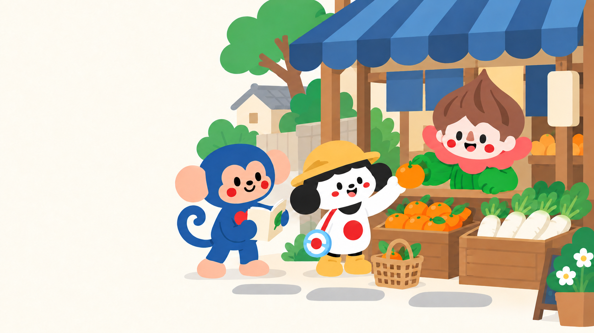
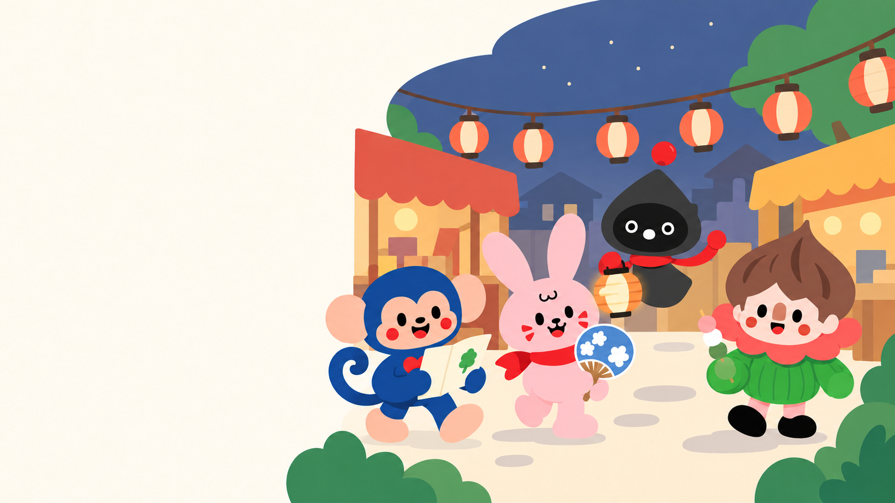

# Style A — landing-page scene collection

User selected A — Flat Adventure for the landing page. B/C/D remain available for other settings. This selection supersedes earlier shortlist/recommendation language. The website has not been edited in this artwork task.

## Morning market

Koko, Gohanko and Tree share an everyday shopping conversation. Suggested placement: conversation/practical Japanese feature or alternate hero. Copy goes on the left.

## Riverside reading

Rabbit, Bear and Tree read together beside a neighbourhood river. Suggested placement: reading/stories feature. Copy goes on the right.

## Lantern evening

Koko, Rabbit, Yauyau and Tree explore a neighbourhood festival. Suggested placement: cultural discovery or closing CTA. Copy goes on the left.

## Identity and delivery notes

Three standalone landscape raster mockups generated with the built-in image tool; prompts.json contains scene briefs, nose-correction-prompt.txt and nose-match-prompt.txt record focused refinements. Tree's nose is a visible dusty-terracotta upright rounded shape, separate from mouth; the sharp triangular treatment was softened against the original 365 reference. Slight contour/scale differences remain between illustrations, so these are not a substitute for a single reusable production face master. Tree's festival hand was corrected to green. A correction that accidentally changed Bear's nose was followed by a Bear-only restoration; that intermediate is not delivered.

All intended characters are present, noses remain visible, and festival Yauyau has two scarf-arms. These are flattened illustration files with cream copy space, not transparent cutouts or editable scenes. Text and CTA should remain live UI. On narrow screens, place text above/below the illustration rather than shrinking a complete desktop composition until faces become unreadable. Actual page-size/mobile QA remains part of integration.
