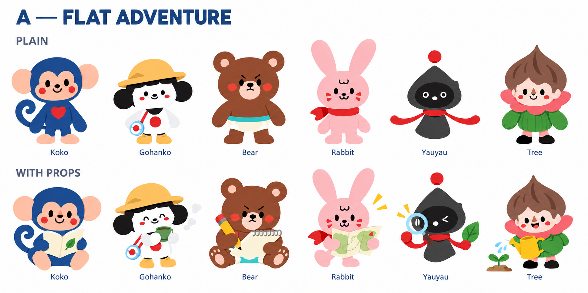
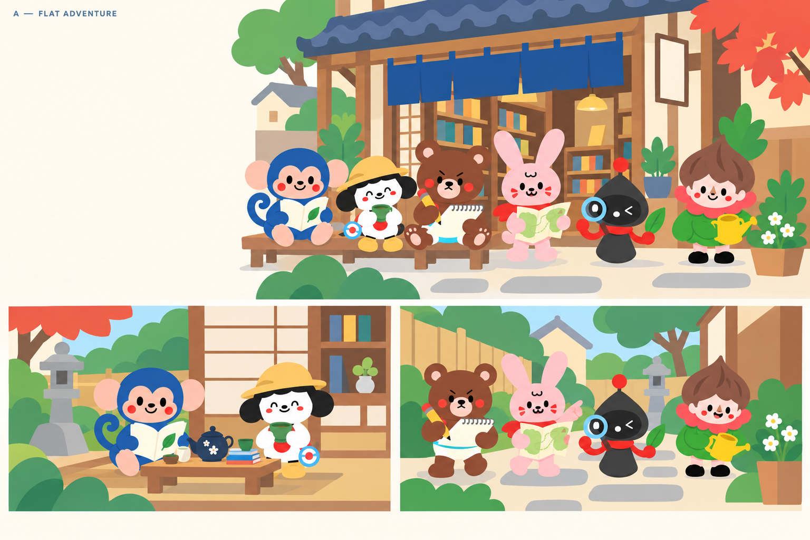
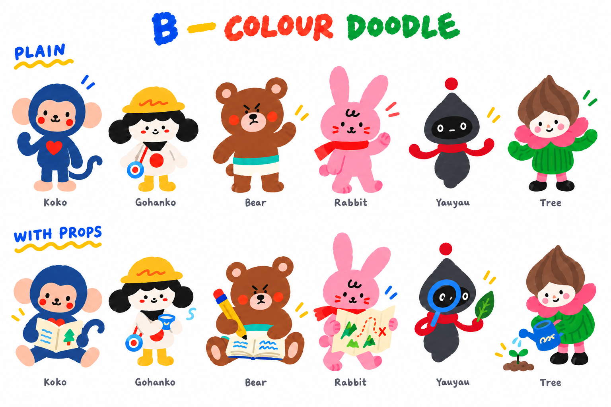
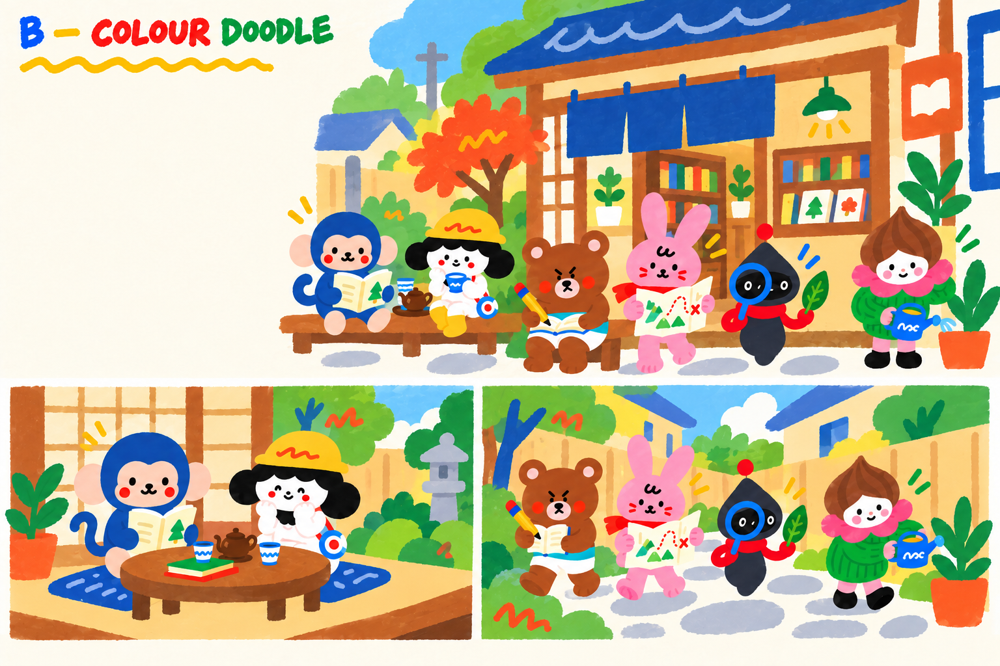
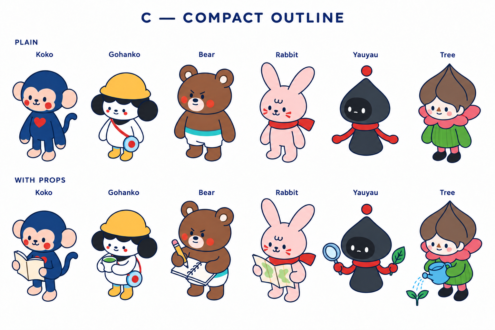
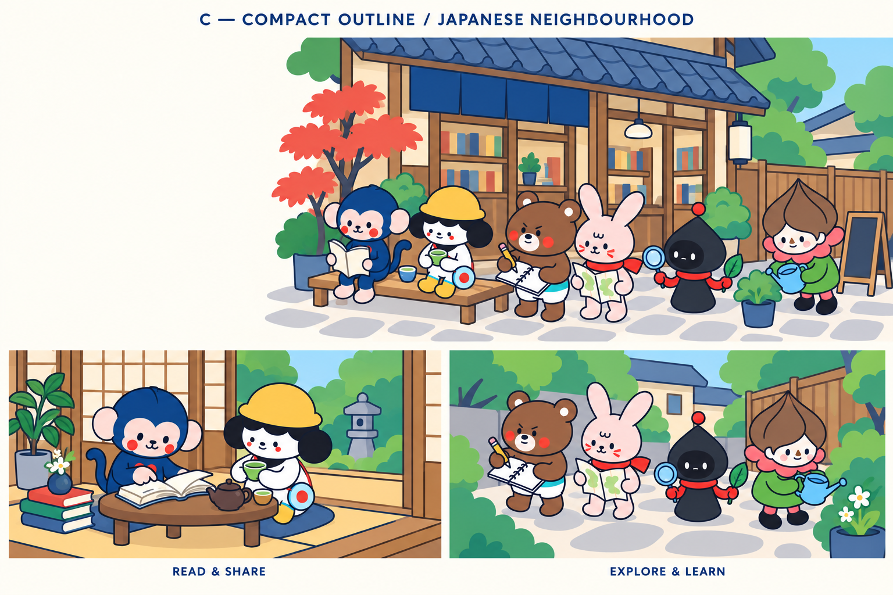
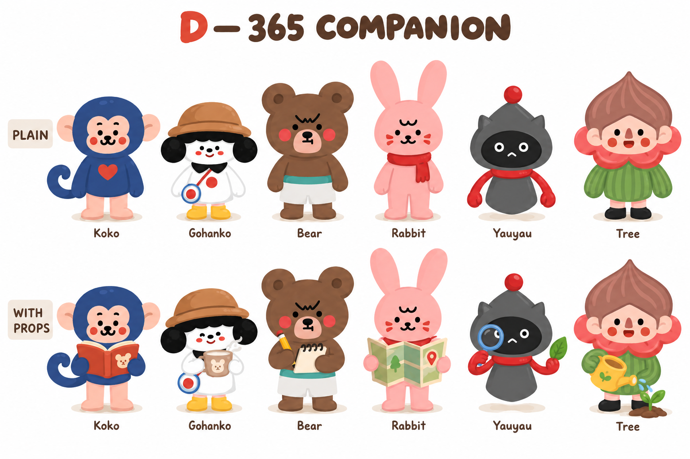
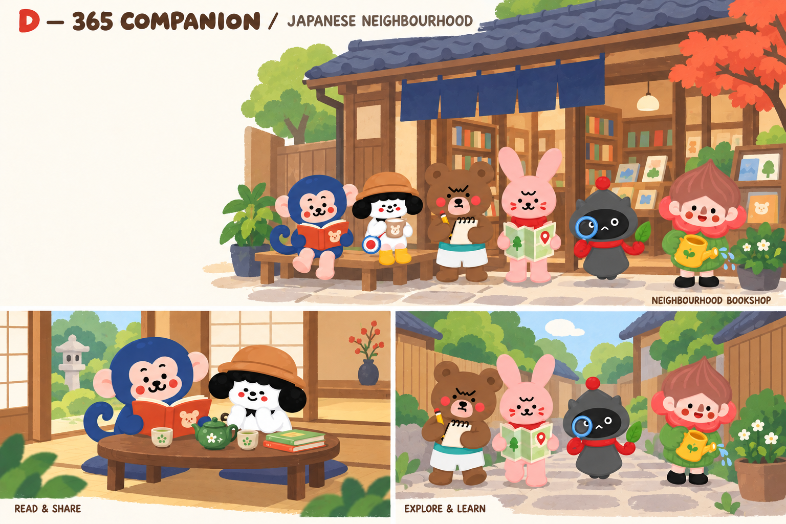

# Four styles for the Japanese landing page

Each scene board shows a neighbourhood bookshop hero, a reading-and-tea vignette, and a garden exploration vignette. Headline and CTA would be live UI in the reserved hero space.

## A — Flat Adventure

Best general landing-page candidate: clear shapes and low visual complexity.

## B — Colour Doodle

Most playful option; strongest for campaigns and seasonal activity content.

## C — Compact Outline

Most structured option; useful for maps, spaces and explainers. Compact anatomy is retained.

## D — 365 Companion

Closest to the authored 365 family; useful for narrative learning and cultural stories.

[Usage and identity guide](GUIDE.md) · [Inspection notes](QA.md)
